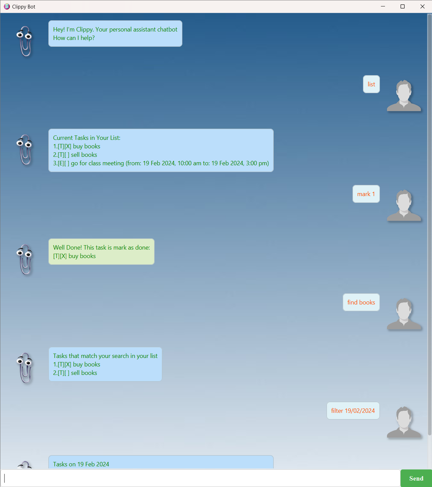

# Clippy User Guide

This is a user guide for my CS2103T individual project. It is a **chatbot that helps you to remember all your tasks**.

- [Quick start](#quick-start)
- [Adding todo tasks](#adding-todo-tasks)
- [Adding deadline tasks](#adding-deadline-tasks)
- [Adding event tasks](#adding-event-tasks)
- [Listing all tasks](#listing-all-tasks)
- [Marking tasks](#marking-tasks)
- [Unmarking tasks](#unmarking-tasks)
- [Deleting a task](#deleting-a-task)
- [Filtering the tasklist by date](#filtering-the-tasklist-by-date)
- [Finding tasks by keywords](#finding-tasks-by-keywords)
- [Reverting the tasklist](#reverting-the-tasklist)
- [Closing the program](#closing-the-program)

## Quick start
1. Ensure you have Java `17` or above installed on your computer.
2. Download the latest `jar` file from here.
3. Copy the file to the folder you want to use as the Home directory.
4. Open a command terminal, `cd` to the directory and enter `java -jar clippy.jar` to run the application.
5. Refer to the Features below to learn more about the commands.

## Adding `todo` tasks
Adds a `todo` task to the tasklist

Format: `todo TASK_NAME`

Examples:
- `todo meet tom`
- `todo get some groceries`

## Adding `deadline` tasks
Addds a `deadline` task to the tasklist

Format: `deadline TASK_NAME /by dd/MM/YYYY HHmm`

Examples:
- `deadline sell books /by 11/10/2025 1800`
- `deadline finish writeup /by 10/02/2025 0800`

## Adding `event` tasks
Adds an `event` task to the tasklist

Format: `event TASK_NAME /from dd/MM/YYYY HHmm /to dd/MM/YYYY HHMM`

Examples:
- `event lunch with tom /from 11/01/2025 1100 /to 11/01/2025 1300`
- `event performance review /from 13/01/2025 0800 /to 14/01/2025 0800`

## Listing all tasks
Lists all the current tasks in the tasklist

Format: `list`

## Marking tasks
Marks a task which means it is completed

Format: `mark TASK_NUM`

Examples:
- `mark 3`

## Unmarking tasks
Unmarks a task which means it is not completed

Format: `unmark TASK_NUM`

Examples:
- `unmark 2`

## Deleting a task
Removes a task from the tasklist

Format: `delete TASK_NUM`

Examples:
- `delete 2`

## Filtering the tasklist by date
Shows all tasks that match the input date

Format: `filter dd/MM/YYYY`

Examples:
- `filter 02/02/2025`

## Finding tasks by keywords
Searches for tasks that contain a specific word in the description

Format: `find KEYWORD`

Examples:
- `find books`
- `find sell books`

## Reverting the tasklist
Reverts the tasklist to the last action performed on the task list, bringing it back to its previous state

Format: `undo`

## Closing the program
Closes the application

Format: `bye`
